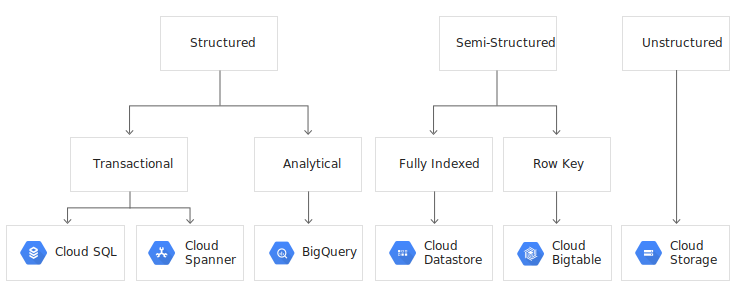

# Buidling & Operationalizing Storage Systems

- [Cloud SQL]()
- [Cloud Spanner]()
- [Cloud Bigtable]()
- [Cloud Firestore]()
- [BigQuery]()
- [Cloud Memorystore]()
- [Cloud Storage]()

## Key Concepts

fully managed : does not require as much administaration & operational support as an unmanaged DB : Google'll take car of core opetaional tasks, backups, OS updates, scaling, failover configuration, monitoring, authorizing network conections.

## Cloud SQL

1. Characteristics
    - fully managed
    - relational DB : support MySQL, PostgreSQL, SQL Server (beta)
    - Storage : up to 30TB for one instance (if more consider Cloud Spanner)
    - Region : single (not multi) otherwise consider Cloud Spanner
    - Configuration
        - choose a RDBMS
        - instance Id & pw
        - region & zone
        - DB version
        - machine type (vCPUs, RAM, HDD or SSD)
        - public (by default) or private IP address
    - Backup : daily, user specify a 4 hour-tim window of maintenance
    - High Availability 
        - By default one instancein a single zone
        - Option : create a 2nd instancein a 2nd zone & synchronously replicate data from the primary instance to the standby one
    - Good Practice : shard your data into smaller DB rather than have a single monolithic DB (the way to shard depend on the use case)

2. Read performance Improvement
    -   By using replicas (a copy of the primary instance's data that is maintained in the same region), apps can read rom the read replica and allow the primary instance to handle write operations.
    - Read replicas not for HA
    - No load balancing between multiple replicas of an instance
    - No backup on a read replica
    - A replica can be promoted to a standalone Cloud SQL (irreversible op)
    - The primary instance cannot be restored from backup if a replica existas (it has to be promoted or deleted)

3. Import & export
    - Generally from & to Cloud Storage buckets (CSV or SQL dump files)
    - Export can be compressed : mysqldump, pg_dump (for postgre) & bcp (bulk copy program) for SQL Server. 

## Cloud Spanner

1. Characteristics
    - fully managed __???????????????__
    - relational DB with strong consistency
    - Scalable : horizontally
    - Configuration :
        - instance name & Id, pw
        - single or multi (more costly) regional - region in which to create the instance
        - Number of nodes (dictated by your workload, keep CPU < 65% a single region and < 45% for multi)
        - machine type (vCPUs, RAM, HDD or SSD)
        - public (by default) or private IP address
    - Backup : __???????????????__
    - High Availability : yes, but doesn't require failover instance in the same way Cloud SQL does. Automatic replication.

    - Good Practice : __???????????????__
    
2. Replication
    - Maintains multiple replicas of rows of data in multiple locations (implements globally synchronous replication)
    - You can read the latest data in a row from any replica
    - One of the replica is designated leader & is responsible for writing.
    - Use replicas for availability as well as reducing latency
    - But its distributed nature creates challenges for writing data : a voting mechanism is used for synchronization.
    - 3 types of replicas
        - read-write: maintain full copies & serve read ops, can vote on write ops
        - read-only: maintain full copies & serve read ops, can not vote
        - witness: do not keep full copies but participate in write votes (for the quorum)
    - regional instances use only read-only repl, multi-regional instances use all 3

3. DB design & considerations
    - can have hostposts where many I/O ops are happening on the smae node instead of multiple ones. When using sequentially primary keys (auto-incrementing counters or timestamps) -> Use hash of the sequentially value instead to distribute work.
    - relational DB are often normalized (you can make joins) __???????????????__
    Cloud Spanner allow for interleaving data form different talbes (advantage of parent-child relationship between talbes when creating the DB schema) __???????????????__

3. Import & export
    - from or to Cloud Storage
    - export in Apache AVRO or CSV formats, implemented by Coud Dataflow connector
    - performance factors
        - DB size
        - Nb of secondary indexes
        - Location
        - Load & number of nodes

## Cloud Bigtable

1. Characteristics
    - managed service but not a NoOps service like Cloud SQL or Cloud Spanner
    - wide-column NoSQL DB used for high-volume DB that require low latency (few ms) IoT, time-series, finance... 
    - Configuration :
        - instance name & Id, pw
        - storage type (HDD or SSD)
        - development or production cluster (with HA & requires a least 3 nodes)
        - cluster ID, region, zone, and number of nodes (scale linearly with the nodes nb)
        - for multi regional HA, create a replicated cluster in another region (automatic or manual failover)
    - expensive service
    - use for migration from HBase
    - can be accessed from BigQuery (in beta)
    
2. DB design & considerations
    - fundamentally different form relational db : denormalized, with 1000s of columns, no support for joins or for secondary indexes
    data stored lexicographically by row-key: it's the one indexed col
    - Keeps related data in ajdacent rows to help make reads more efficient
    all operation are atomic at the row level, not a transaction level

3. Import & export

## Cloud Firestore

## BigQuery

## Cloud Memorystore

## Cloud Storage

1. Characteristics
    - fully managed???
    - relational DB : ??
    - Configuration : ??

    - Backup : ??
    - High Availability 

    - Good Practice : ??
    
2. Read performance Improvement

3. Import & export