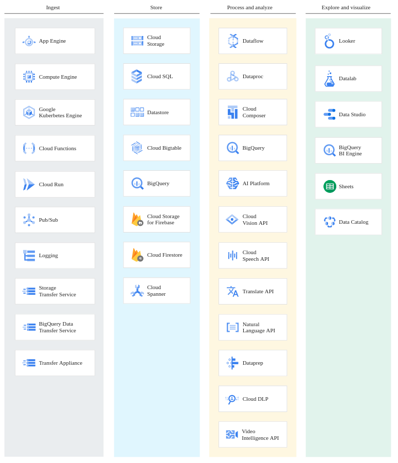

# All GCP components

Compute
- Compute Engine
- App Engine
- Container Engine
- Container Registry
- Cloud Functions

Identity and Security
- Cloud IAM
- Cloud Resource Manager
- Cloud Security Scanner
- Cloud Platform Security

Networking
- Cloud Virtual Network
- Cloud Load Balancing
- Cloud CDN
- Cloud Interconnect
- Cloud DNS

https://cloud.google.com/about/locations/

Big Data
- Big Query
- Cloud Dataflow
- Cloud Dataproc
- Cloud Datalab
- Cloud Pub/Sub
- Genomics

Storage and Database
- Google Spanner
- Cloud Storage
- Cloud Bigtable
- Cloud Datastore
- Cloud SQL
- Persistent Disk

Machine Learning
- Cloud Machine Learning
- Vision API
- Speech API
- Natural Language API
- Translation API
- Jobs API

Management Tools
- Stackdriver
- Monitoring
- Logging
- Error Reporting
- Trace
- Debugger
- Deployment Manager
- Cloud Endpoints
- Cloud Console
- Cloud Shell
- Cloud Mobile App
- Billing App

Developer Tools
- Cloud SDK
- Deployment Manager
- Cloud Source Repo
- Could Tools for Android
- Cloud Tools for InteliJ
- Cloud Tools for PowerShell
- Cloud Tools for Visual Studio
- Google Plugin for Eclipse
- Cloud Test Lab

API & Ecosystem Management
- API Management
- API monetization
- API Analytics
- APIGEE Sense
- Cloud Endpoints

Data Transfer
- Cloud Transfer Appliance
- Cloud Storage Transfer Service
- Cloud BigQuery Data Transfer Service

