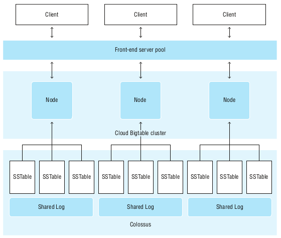

# DB Design Databases for Reliability, Scalability, and Availability

- [Cloud Bigtable](DB_scale#provisioning--adjusting-resources)
- [Cloud Spanner](DB_scale#monitoring-processing-resources)
- [Cloud BigQuery](DB_scale#monitoring-processing-resources)

Cloud SQL which does not scale beyound the region level is not covered here.

#  Cloud Bigtable DB - Scalability & Reliability
a nonrelational DB based on a sparse 3D map (3D = rows, columns & cells).

## Data modeling
Bigtable DBs are deployed on a set of resources known as an instance :
- it's not the same thing as a VM instance in Compute Engine
- it consists of  a set of nodes, which are VMs, as well as a set of sorted string tables and log data stored in Google’s Colossus FS

- The nodes manage the metadata
- The actual data is stored on the Colossus FS & organized into sorted string tables (SSTables or tablets in GCP terminology) which are immutable.

Pros of separating metadata from data:
- Fast rebalancing of tablets from one node to another
- The ability to recover a failed node by migrating metadata only
- The scalability, reliability, and availability of the Colossus FS

A master process balances workloads in a cluster, including splitting and merging tablets.

1. Rows are indexed by a row-key (similar to a primary key in a relational db). Data is stored in a lexicographically sorted order by row-key
2. Columns are grouped into column families : frequently used together data are retrieved more efficiently
3. Cells are used to store multiple versions of a value over time. The value in the cell with the latest timestamp is returned by default

Cloud Bigtable tables are sparse : no data for a particular row/column/cell no storage used
- fewer large tables is preferred to many small tables (that require more backend connection overhead).
- different table sizes can disrupt the load balancing in background
- operations are atomic at the row level : multiple changes made to related data will all succeed or fail together (but size is limited: 10 MB in a single cell & 100 MB in a single row)

## Row-keys Design
Bigtable scales best when R/W operations are distributed across nodes and tablets.

### Best Practices
- avoid monotonically increasing values or lexicographically close strings:  this can cause hotspots (exception for reverse domain names: Bigtable can compress the repeated data efficiently)
- when a using a multitenant Bigtable db, use a tenant prefix in the row-key to keep all customer’s data together)
- String ID are good candidates for a row-key
- Timestamps not the entire row-key or the start of it (helpfull for range scans based on time)
- in general move toward the front of the key, values that are highly varied.
- to avoid hotspots use salting (adding a derived value to the key to make writes noncontiguous)

### Antipatterns (to be avoided)
- Domain names
- Sequential numeric IDs
- Frequently updated identifiers
- Hashed values

### Key Visualizer
a Bigtable tool for understanding usage patterns in a database, it generates hourly and daily scans (heatmap) & helps to identify:
- where hotspots exist
 -rows that may contain too much data
- the distribution of workload across all rows in a table

### Time Series
well suited for financial data & IoT data streams, low-latency writes & highly scalable, tables with many rows and few columns (ie tall & narrow tables), queries using time ranges

Recommandations
- keep names short (reduce the size of metadata) 
- favor tables with many rows and few columns (makes querying easier without exceeding max recommended row sizes)
- use one table per modeled entity
- design row-keys for looking up a single value or a range of values

## Replication for Availability & Scalability
Keeping multiple copies of your data in multiple regions or multiple zones can improve availability and durability, distribute workloads across multiple clusters.
Bigtable supports up to 4 replicated regional or multi-regional clusters:
- all changes are replicted in the other clusters
- there is no single primary cluster: all replicated clusters can perform R/W
- eventually consistent (all replicas should be updated within a few sec. or min.)
- specify _read-your-writes consistency_ to ensure that a cluster will never read data that is older than its most recent writes
- specify _single-cluster routing_ for strong consistency

# Cloud Spanner DB for Scalability & Reliability
Cloud Spanner is a globally scalable relational database that offers many of the scalability benefits once limited to NoSQL databases. It does so while maintaining key features of relational databases, such as support for normalized data models and transaction support. Data engineers need to understand factors that influence the performance of Cloud Spanner databases in order to avoid design choices that can limit performance and scalability.

For the purposes of the Cloud Professional Data Engineer exam, it is important to understand several aspects of Cloud Spanner, including

Relational database features
Interleaved tables
Primary keys and hotspots
Database splits
Secondary indexes
Query best practices
Relational Database Features
Many of Cloud Spanner features are common to other relational databases. The data model is centered around tables, which are composed of columns that represent attributes and rows that are collections of values for attributes about a single entity. For example, an e-commerce application may have tables about customers, orders, and inventory, with rows representing a single customer, order, and inventory item, respectively. The customer table may have columns such as customer name, address, and credit limit, whereas the order table may have an order ID, date of order, customer ID, and total value of the order. An inventory table could have columns with product names, quantity, and location of the item in a warehouse.

Relational databases are strongly typed. Cloud Spanner supports the following types:

Array: An ordered list of zero or more elements of a non-array type
Bool: Boolean TRUE or FALSE
Bytes: Variable-length binary data
Date: A calendar date

