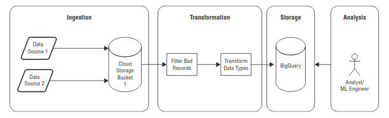

# Selection of the appropriate Storage Technology

Various critera to consider when chossing a storage technology

## Buisness Aspects

Different storage systems for different purposes, the choice is determined by the stage of the data lyfecycle:
- Ingestion : acquiring data & bringing it into the Cloud
- Storage : persisting data for later use
- Processing & analysis : transformation in a usable format & description
- Exploration & dataviz : making insights from tables / charts for others/ decision

1. Ingestion

    1. Application Data
        - Generated by Mobile / Web (backend services) / Software apps
        - Examples : Transactions from an online retail app. Clickstream from users reading articles on a web site. Logs from a software. User registration from an online service.
        - The volume of data depends on the number of users (can vary widely)
    2. Streaming Data
        - Sent in small messages transmitted continuously from the source
        - Event time including a time stamp : need to be ordered (insertion in the correct position requires buffering ) for processing --> time series analysis
        - Examples : VMs monitoring data, IoT devices / Sensors, Customers adding items to an online shopping cart...
    3. Batch Data
        - In bulk, typically in files uploaded.
        - Examples : transaction data, archives, migration from on premises
        - Cloud storage is typically used for batch uploads, eventually in conjunction with Cloud Transfer Service and Transfer Appliance for large volumes.

2. Storage
    1. How data is accessed : for instance, online transaction (query for specific records using a set of filters) vs a ML pipeline (training with thousand rows ie in batch mode) 
    2. Access constrols :fffffffffffffffffffffff
    3. How long data will be stored :
        - if transient : could be stored on SSD (lost when instance shut down)
        - if frequently used : well suited in either relational or NoSQL db
        - policies to migrate older data to nearline (used once a month) or coldline (used once a year), with age can be deleted (if compliant with regulations) or archived 

3. Processing & analysis
    1. Transformation
        - Map into forms that make the data readily available to ad-hoc queries / analytics
        - Cleansing, correcting errors according to the data type or buisness logic (depends on the use case), normalizing / standardizing data --> Cloud Dataflow
    2. Analysis
        - Extract usefull infos with statistical techniques
        - Description, characteristics, correlations, predictions, cluster subsets... --> Cloud Dataflow, Cloud Dataproc, BigQuery & Cloud ML Engine
4. Exploration & dataviz
dddddddddddddddddddddddddddddddd

## Technical Aspects

## Variation in data structure

## Schemas for relational & NoSQL db

